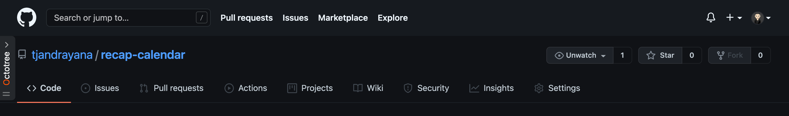
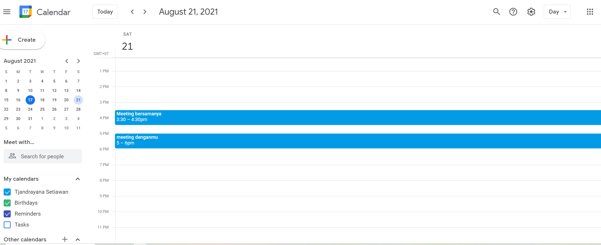
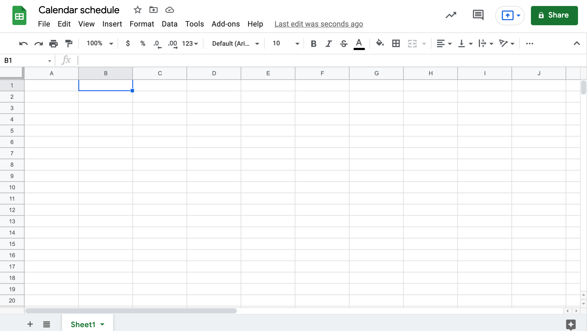
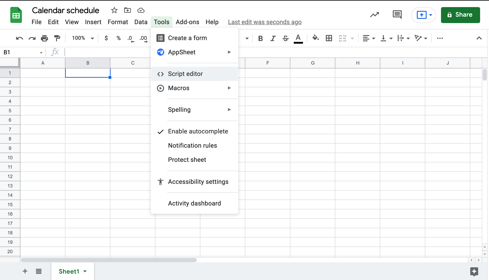
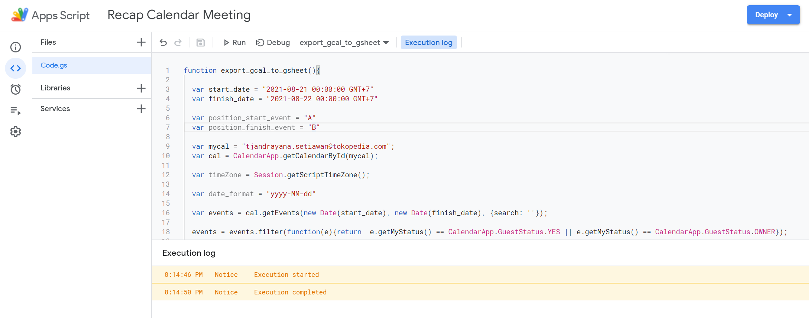
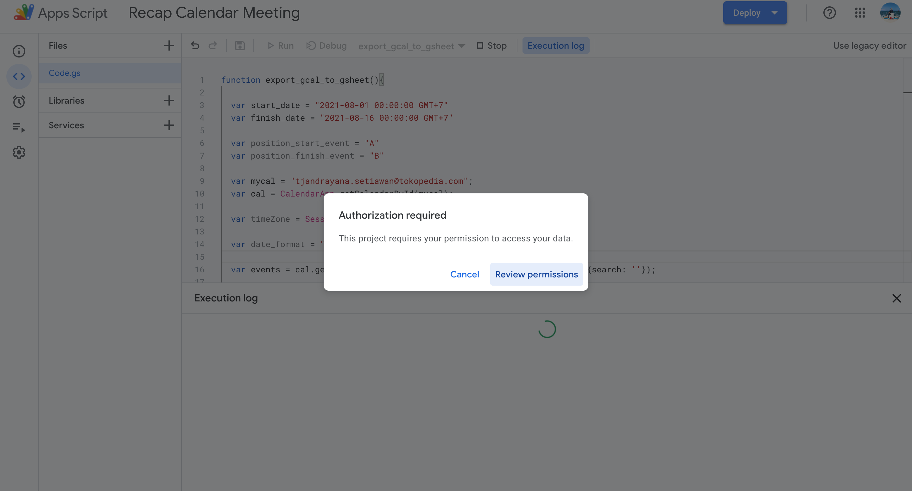
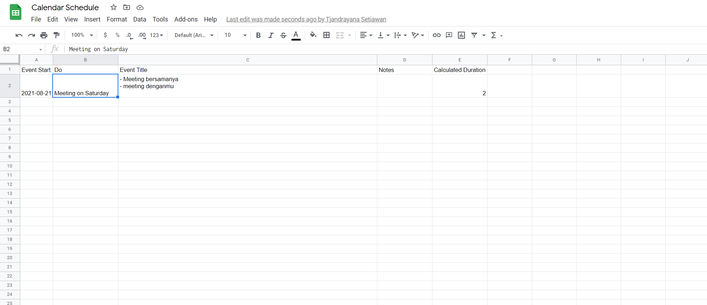

# recap-calendar

recap-calendar is a code develop for all of lazy people. Lazy to recap calendar meeting manually. This code used to help you recap your meeting. Your meeting will be recap automatically whenever you run this code.

# how to use it ?

1. Give start for this url repo https://github.com/tjandrayana
    

2. Open your calendar 

     

3. Open a new google sheets

    

4. Find the script editor inside Tools
    
    

5. You will be redirect to Apps Script

6. Copy the code in the code.gs and paste in the Apps Script
    
    

7. Change the email as yours in line 9

8. Set your start_date and finish_date in line 3 & 4

9. Run the code 

10. Setup the permission

    

11. Open the sheet before

    
